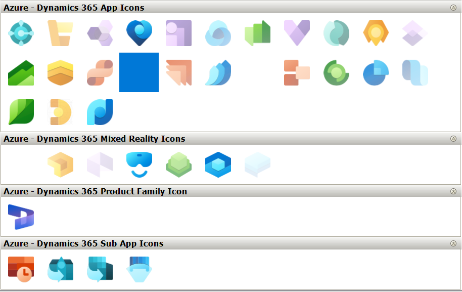

# Azure Architecture Icons Palettes for yED

[yED](http://www.yworks.com/en/products/yfiles/yed/) is an awesome diagraming software. [Microsoft Dynamics 365 icons](https://learn.microsoft.com/en-us/dynamics365/get-started/icons) is a Microsoft-created icon set for use in Dynamics 365 (aka O365) architecture diagrams.

This repository contains pre-made palettes to import O365 icons into yED to start diagramming with Dynamics 365 Icons immediately!

# Credits

This repository is based on the [yed-azure-palettes](https://github.com/danmana/yed-azure-palettes) repository, which itself was based on the [yed-aws-palettes](https://github.com/JustDerb/yed-aws-palettes) repository. If you need Azure or AWS icons go check them out.

# Icon terms

Microsoft releases these icons under the following [terms](https://learn.microsoft.com/en-us/dynamics365/get-started/icons#terms):

> Microsoft permits the use of these icons in architectural diagrams, training materials, or documentation. You may copy, distribute, and display the icons only for the permitted use unless granted explicit permission by Microsoft. Microsoft reserves all other rights.

*Disclaimer:* by using the `*.graphml` generated palettes you agree to these terms.

*Note:* all other code, except the generated icons is released under MIT license.

# Preview



# Support

## Updating yED with new icons

You can use "Import Section..." in yED as described [here](http://yed.yworks.com/support/manual/palette_manager.html).

- Inside yED, go to "Edit" > "Manage Palette..."
- Select "Import Section..."
- In the file dialog, select all of the `.graphml` files and select "Okay"

This should override any sections with the same name in yED.

### Deleting old palettes

You can use "Delete Section" in yED as described [here](http://yed.yworks.com/support/manual/palette_manager.html).

- Inside yED, go to "Edit" > "Manage Palette..."
- Select a single palette you want to delete
- Select "Delete Section"

## Updating this repository

This repo has minimal automation around it, so it should update at most daily. If this repo needs to be manually updated, simply grab the latest URL and run the `update.sh` script:

```bash
# Grab latest URL from website
URL=$(curl -s https://learn.microsoft.com/en-us/dynamics365/get-started/icons | grep 'Download SVG icons' | grep -oEi '//.*\.zip' | while read line; do echo "https:$line";  done)
echo "Latest URL: $URL"
# Run the updater, commiting the results
./update.sh "$URL" true
```

On Windows systems, "Git Bash" can be used to run these commands.